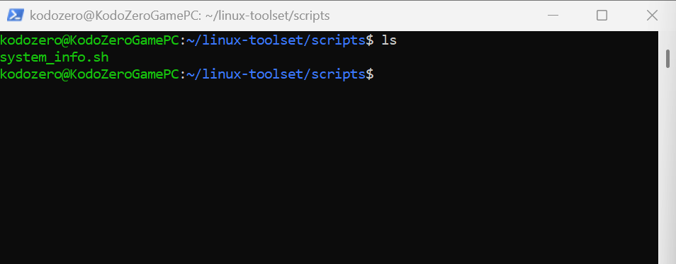
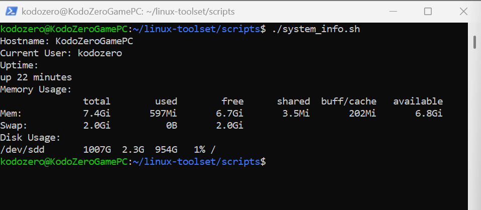
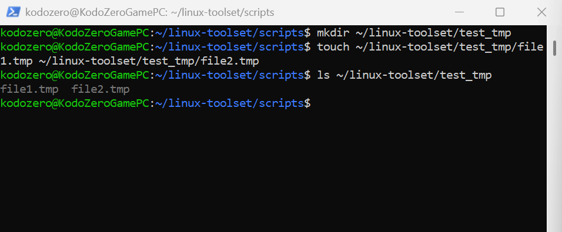
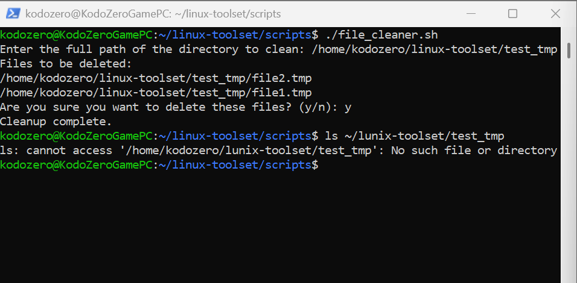
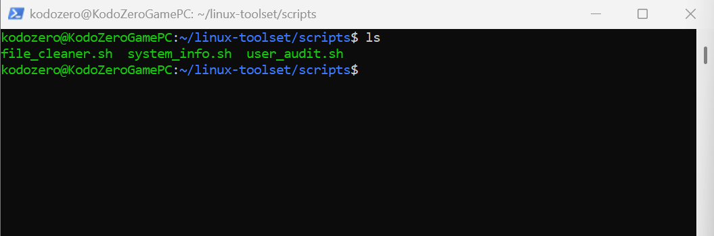
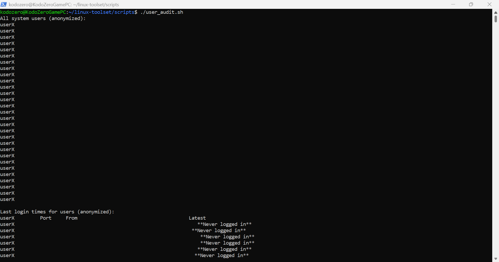
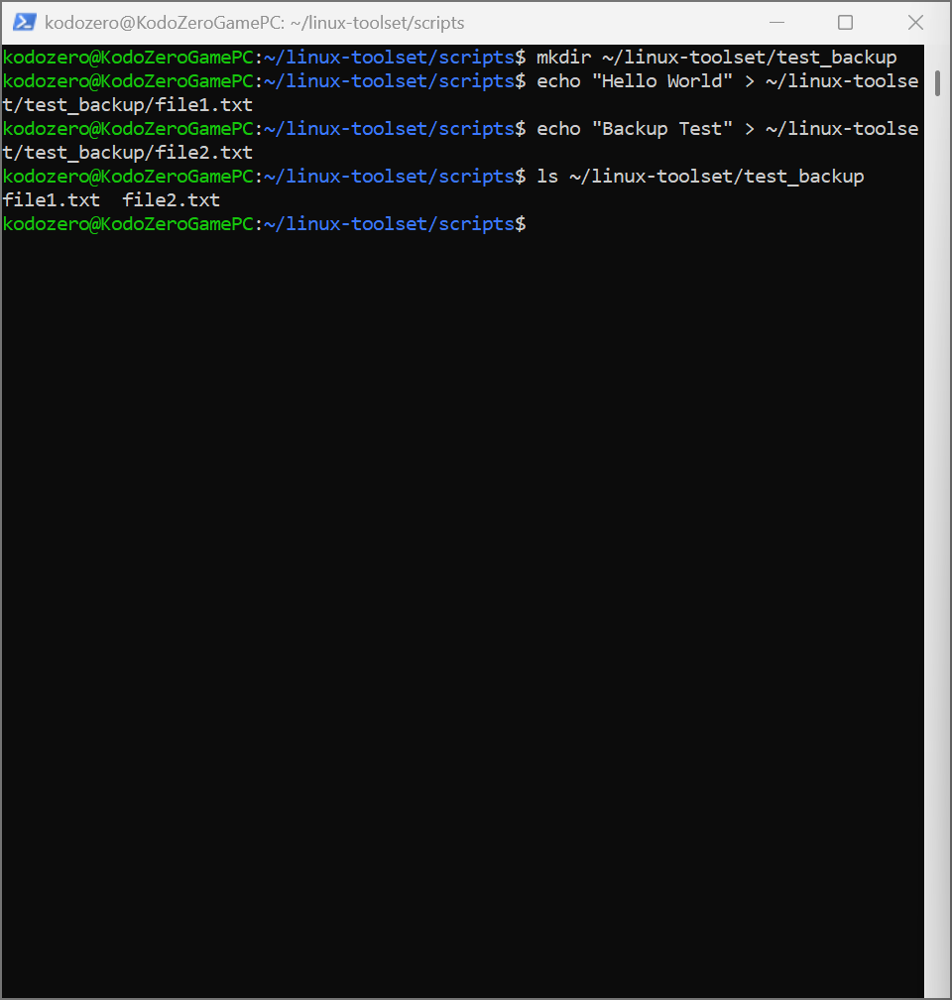
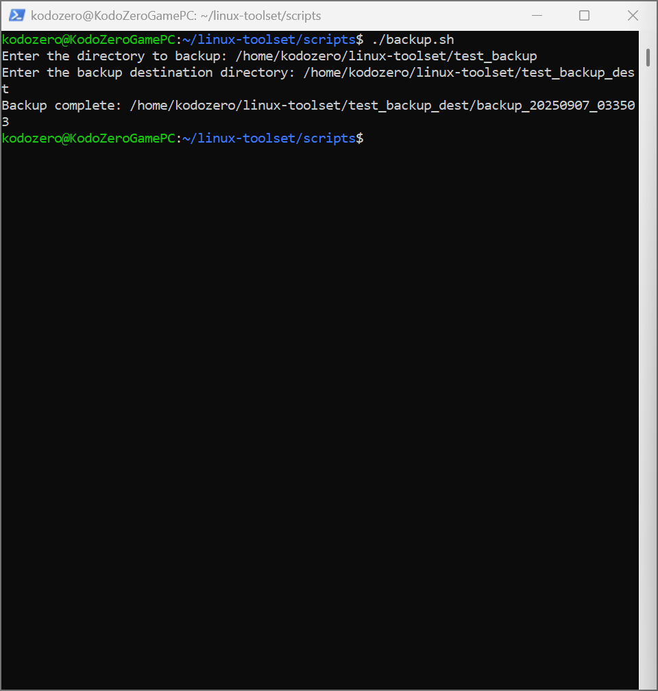
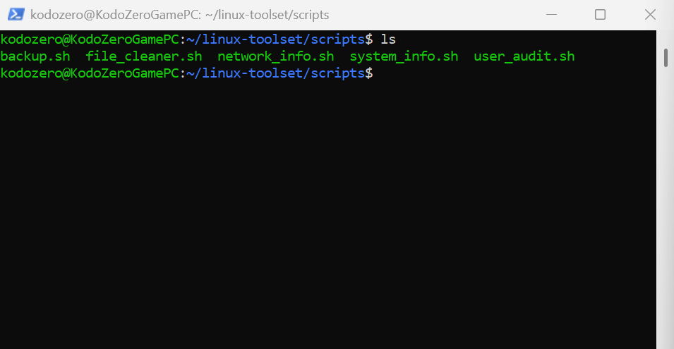
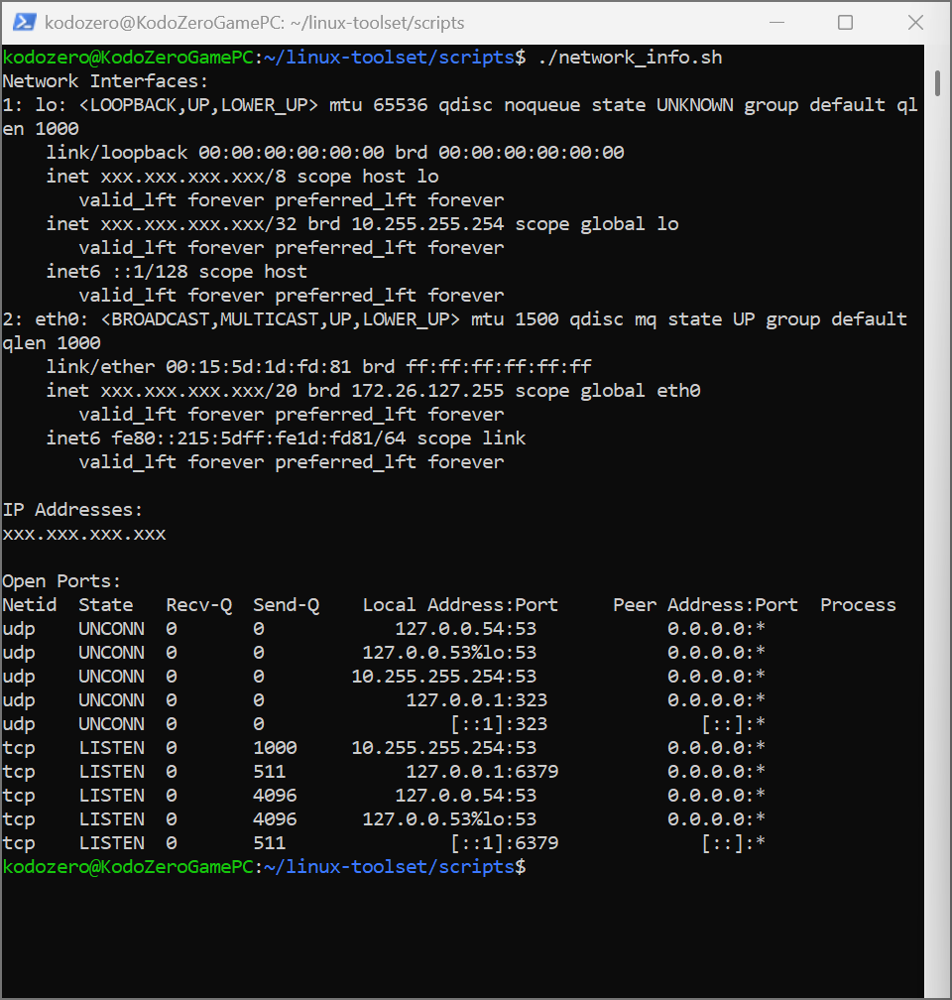

# Project Axis — Phase 1: Linux Toolset

This repository is part of **Project Axis**, documenting my cybersecurity journey.  
Phase 1 focuses on building foundational Linux scripting skills, including system info, file management, user auditing, backups, and network enumeration.

All scripts include safety checks and are fully documented with example outputs.

---

## 🔹 Repo Structure
- **scripts/** → All Bash scripts created in this phase.  
- **examples/** → Screenshots of code, before running, and after running each script.

---

## 🛠️ Scripts

### 1. system_info.sh
**Purpose:** Displays system information such as kernel version, uptime, memory, and disk usage.  
**Learning Focus:** Linux system commands, formatting output.  
**Examples:**  
-   
- 

---

### 2. file_cleaner.sh
**Purpose:** Safely deletes `.tmp` files in a target directory with confirmation prompts.  
**Learning Focus:** User input, file operations, safe scripting practices.  
**Examples:**  
-   
- 

---

### 3. user_audit.sh
**Purpose:** Lists system users and last login times (anonymized for GitHub).  
**Learning Focus:** User management, auditing, anonymization for privacy.  
**Examples:**  
-   
- 

---

### 4. backup.sh
**Purpose:** Creates a timestamped backup of a target directory.  
**Learning Focus:** Variables, loops, file copy, timestamps.  
**Examples:**  
-   
- 

---

### 5. network_info.sh
**Purpose:** Shows network interfaces, IP addresses (anonymized), and open ports.  
**Learning Focus:** Network enumeration, command-line networking tools, safe output handling.  
**Examples:**  
-   
- 

---

## 📌 Notes
- All outputs have been anonymized for safe public posting.  
- Phase 1 demonstrates foundational Linux scripting and toolset creation.  
- Future phases of Project Axis will build on this foundation:  
  - Security Monitoring & Logs  
  - Defensive Security Tools  
  - Ethical Hacking Labs

---

## 👨‍💻 Author
**Clifton Saintfleur** — Cybersecurity Student  
